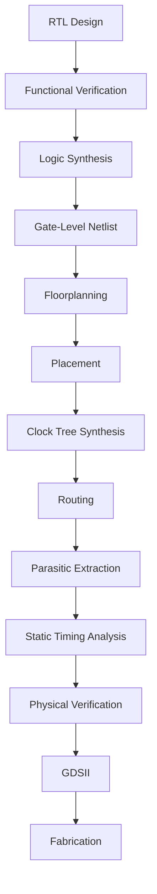
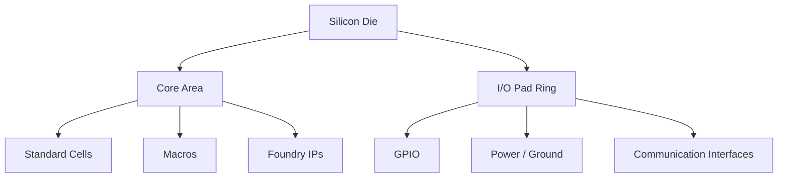
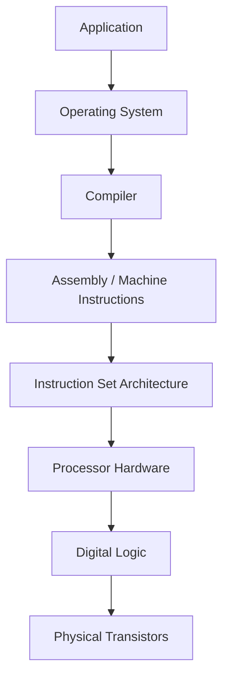
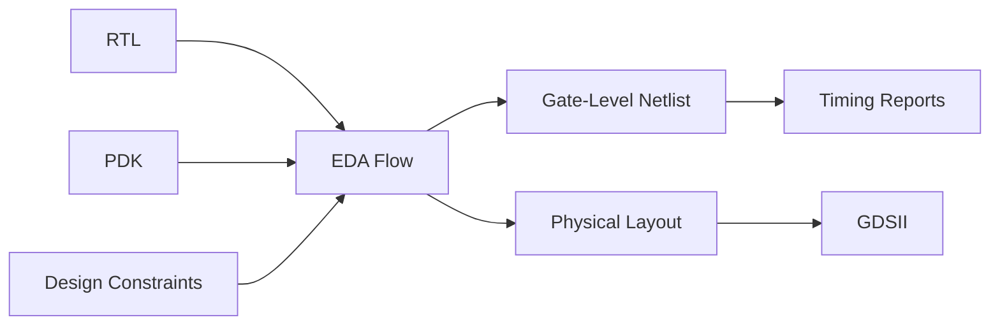
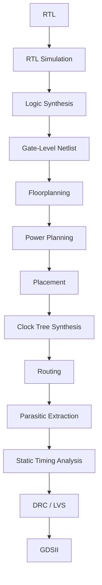
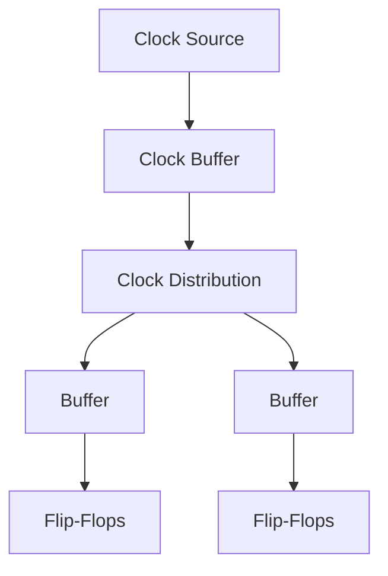
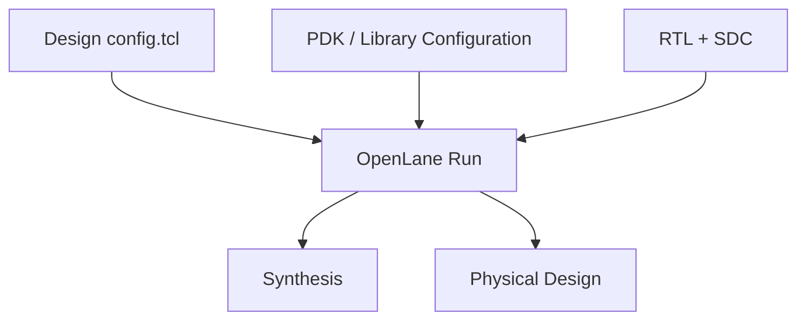
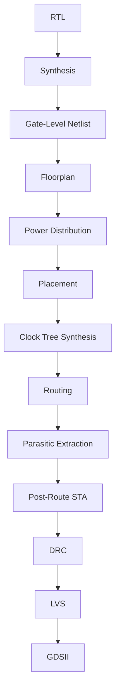
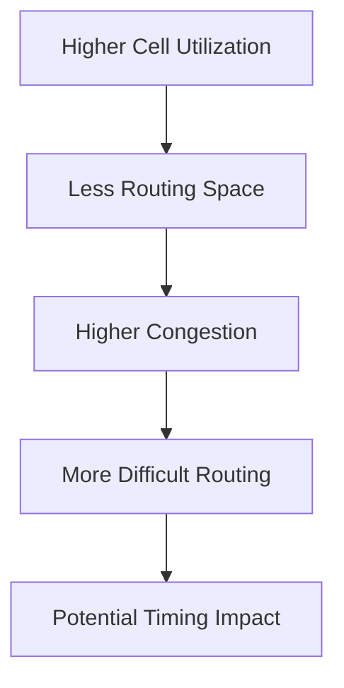
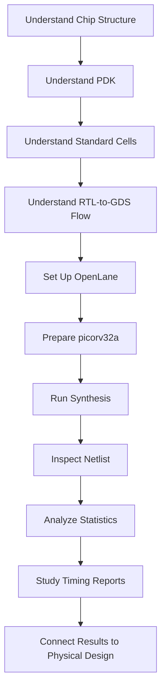

# PHYSICAL-DESIGN-DAY1


> **Digital VLSI | Physical Design | RTL-to-GDSII | SKY130 | OpenLane**

---

##  Overview


The practical work uses an open-source digital ASIC environment based on:

* **SKY130 PDK**
* **OpenLane**
* **Yosys**
* **ABC**
* **OpenSTA**
* **OpenROAD**
* **Magic**
* **Docker**

The practical portion uses the **picorv32a** design to understand how an RTL design is prepared, synthesized and converted into a gate-level representation.

---

#  Table of Contents

1. [Learning Objectives](#-learning-objectives)
2. [Physical Design at a Glance](#-physical-design-at-a-glance)
3. [Chip Anatomy](#1-chip-anatomy)
4. [Foundry IPs and Macros](#2-foundry-ips-and-macros)
5. [RISC-V From ISA to Physical Layout](#3-risc-v-from-isa-to-physical-layout)
6. [Software-to-Hardware Abstraction](#4-software-to-hardware-abstraction)
7. [RTL, EDA Tools and PDK](#5-rtl-eda-tools-and-pdk)
8. [Complete RTL-to-GDSII Flow](#6-complete-rtl-to-gdsii-flow)
9. [Physical Design Stages](#-physical-design-stages)
10. [OpenLane Environment](#7-openlane-environment)
11. [SKY130 PDK Structure](#8-sky130-pdk-structure)
12. [Design Directory](#9-design-directory)
13. [OpenLane Configuration](#10-openlane-configuration)
14. [Preparing the Design](#11-preparing-the-design)
15. [Understanding the Run Directory](#12-understanding-the-run-directory)
16. [Merged LEF](#13-understanding-the-merged-lef)
17. [Running Synthesis](#14-running-synthesis)
18. [Synthesis Statistics](#15-synthesis-statistics)
19. [Flip-Flop Ratio](#16-flip-flop-ratio)
20. [Gate-Level Netlist](#17-gate-level-netlist)
21. [Static Timing Analysis](#18-static-timing-analysis)


---

# Learning Objectives

The primary objective of this module is to understand how a digital design moves from an **abstract RTL description** toward a physical implementation.

By completing this module, the following concepts are explored:

* Semiconductor chip organization
* Die, core and pad regions
* Standard-cell based design
* Foundry IPs and macros
* RISC-V ISA and RTL implementation
* Digital ASIC design flow
* Process Design Kit (PDK)
* Standard-cell libraries
* RTL synthesis
* Gate-level netlists
* Floorplanning
* Placement
* Clock Tree Synthesis
* Routing
* Static Timing Analysis
* Physical verification
* GDSII generation
* OpenLane configuration
* SKY130 technology files

---

#  Physical Design at a Glance

A digital ASIC does not directly move from Verilog code to a manufactured chip.

There are several intermediate stages through which the design must pass.



The important idea is that each stage adds more physical information to the design.

---

# 1. Chip Anatomy

A semiconductor chip can be viewed at different physical levels.

The major regions are:

* **Die**
* **Core**
* **Pads**

The **die** represents the complete piece of silicon containing the integrated circuit.

The **core** is the central region where most of the digital logic and physical implementation takes place.

**Pads** are located around the boundary and provide interfaces for signals, power and ground between the chip and the outside world.

### Chip-Level View


### Basic Relationship



### Key Concept

The physical organization of a chip is important because the position of cells, macros and interfaces affects:

* Routing
* Congestion
* Timing
* Power distribution
* Area
* Signal connectivity

---

# 2. Foundry IPs and Macros

A modern SoC contains many blocks that are not individually synthesized from RTL.

Two important categories are:

### Foundry IP

These are technology-dependent blocks supplied or characterized for a particular manufacturing process.

Examples include:

* PLL
* ADC
* DAC
* Analog interface blocks
* I/O-related components

### Macros

Macros are relatively large reusable blocks that are integrated into the physical design.

Examples include:

* SRAM
* Processor cores
* Large memories
* Hardware accelerators
* Other pre-designed digital blocks

### Example SoC Organization


The important physical-design distinction is that a macro is generally treated as a physical block during placement and routing rather than being broken down and synthesized like ordinary RTL logic.

---

# 3. RISC-V From ISA to Physical Layout

RISC-V is an **Instruction Set Architecture (ISA)**.

An ISA defines the instructions, registers and architectural behavior that software expects from a processor.

It does not itself define the physical implementation.

The same ISA can therefore be implemented using different microarchitectures and RTL designs.

### RISC-V Implementation Path


### Example

The `picorv32` processor is a compact RISC-V processor implementation described using RTL.

That RTL can then be synthesized into standard cells and eventually converted into a physical layout.


This demonstrates the important relationship:

```text
ISA
 ↓
RTL
 ↓
Synthesized Logic
 ↓
Physical Implementation
 ↓
Layout
```

---

# 4. Software-to-Hardware Abstraction

Hardware and software operate through several layers of abstraction.

A simplified software-to-hardware relationship is:



### Compilation Perspective

For example:

```text
C / C++ Program
      ↓
Compiler
      ↓
Assembly
      ↓
Machine Instructions
      ↓
RISC-V Processor
```

### Hardware Perspective

```text
RTL
 ↓
Synthesis
 ↓
Gate-Level Netlist
 ↓
Physical Design
 ↓
Layout
```

The two abstraction paths eventually meet at the actual hardware implementation.

---

# 5. RTL, EDA Tools and PDK

A digital ASIC implementation depends on three major components.

## RTL

**Register Transfer Level (RTL)** describes the functional behavior of the hardware.

Typical RTL is written using:

* Verilog
* SystemVerilog
* VHDL

For this module, the design is represented using Verilog RTL.

---

## EDA Tools

Electronic Design Automation tools automate complex design tasks.

Examples include:

| Tool     | Purpose                                   |
| -------- | ----------------------------------------- |
| Yosys    | Logic synthesis                           |
| ABC      | Logic optimization and technology mapping |
| OpenROAD | Physical design                           |
| OpenSTA  | Static timing analysis                    |
| Magic    | Layout / physical verification            |
| OpenLane | ASIC implementation flow                  |
| Docker   | Reproducible software environment         |

---

## PDK

A **Process Design Kit (PDK)** contains technology-specific information required to implement a design for a particular semiconductor process.

For SKY130, this includes information such as:

* Standard-cell libraries
* Timing models
* Layout information
* Technology layers
* Design rules
* Physical abstracts
* Electrical models

### RTL + EDA + PDK


The relationship can be summarized as:



---

# 6. Complete RTL-to-GDSII Flow

The complete digital implementation flow converts an RTL description into a physical layout.


### Detailed Flow



---

# 🏗 Physical Design Stages

## 1. Synthesis

Converts RTL into a gate-level netlist using cells from the target standard-cell library.

```text
RTL
 ↓
Logic Optimization
 ↓
Technology Mapping
 ↓
Gate-Level Netlist
```

---

## 2. Floorplanning

Defines the physical organization of the design.

Important parameters include:

* Die area
* Core area
* Aspect ratio
* Utilization
* Macro locations
* I/O placement

---

## 3. Placement

Standard cells are physically positioned within the core.

The placement process attempts to optimize:

* Wire length
* Timing
* Congestion
* Cell density
* Routability

---

## 4. Clock Tree Synthesis

Clock signals must reach sequential elements with controlled delay and skew.

CTS inserts buffers and creates a clock distribution network.



---

## 5. Routing

Routing creates physical metal connections between cells.

It must satisfy:

* Connectivity
* Design rules
* Available routing resources
* Timing constraints
* Congestion limits

---

## 6. Static Timing Analysis

STA checks whether timing constraints are satisfied.

A basic timing path is:

```text
Launch Flip-Flop
       ↓
Combinational Logic
       ↓
Interconnect
       ↓
Capture Flip-Flop
```

Important quantities include:

* Arrival time
* Required time
* Slack
* Setup time
* Hold time
* Clock skew
* Cell delay
* Net delay

---

# 7. OpenLane Environment

The practical work uses OpenLane as the main RTL-to-GDS implementation environment.

OpenLane combines several open-source tools into a reproducible ASIC design flow.

### Tool Relationship


---

# 8. SKY130 PDK Structure

The SKY130 environment contains technology-specific information required by the tools.

The PDK separates reference libraries from technology-specific tool files.

A simplified structure is:

```text
sky130A/
│
├── libs.ref/
│   ├── sky130_fd_sc_hd/
│   ├── sky130_fd_sc_hs/
│   └── SRAM libraries
│
└── libs.tech/
    ├── magic/
    ├── openlane/
    ├── klayout/
    ├── qflow/
    └── other tool data
```

### Important File Types

| File     | Purpose                       |
| -------- | ----------------------------- |
| `.lib`   | Timing and power information  |
| `.lef`   | Physical abstract information |
| `.tlef`  | Technology LEF                |
| `.v`     | Verilog models                |
| `.spice` | Circuit-level models          |
| `.gds`   | Physical layout               |

### PDK Exploration


This establishes an important relationship:

```text
PDK
 ├── Logical Information
 ├── Timing Information
 ├── Physical Information
 └── Technology Rules
```

---

# 9. Design Directory

OpenLane organizes designs into individual directories.

For the example design:

```text
designs/
└── picorv32a/
    ├── config.tcl
    ├── src/
    │   ├── picorv32a.v
    │   └── picorv32a.sdc
    └── ...
```

The design directory contains the RTL, constraints and configuration required to run the flow.


---

# 10. OpenLane Configuration

The `config.tcl` file defines important parameters for the design.

Typical information includes:

* Design name
* RTL source
* Clock port
* Clock period
* PDK
* Standard-cell library
* Utilization
* Placement parameters
* Routing configuration


### Configuration Relationship



---

# 11. Preparing the Design

Before starting the actual implementation, the OpenLane environment must be available.

The Docker environment provides a controlled software setup.

### Checking Docker Images

```bash
docker images
```

This allows the available OpenLane image to be checked before starting the container.


---

## Starting the OpenLane Container

A typical command is:

```bash
docker run -it \
  -v $PWD:/openLANE_flow \
  -v $PDK_ROOT:$PDK_ROOT \
  -e PDK_ROOT=$PDK_ROOT \
  -u $(id -u $USER):$(id -g $USER) \
  efabless/openlane:v0.21
```

After entering the container:

```bash
./flow.tcl -interactive
```

The OpenLane Tcl environment can then be loaded using:

```tcl
package require openlane 0.9
```


# 12. Understanding the Run Directory

The design is prepared using:

```tcl
prep -design picorv32a
```

This creates a new timestamped run directory.


A typical run structure contains:

```text
runs/
└── <timestamp>/
    ├── config.tcl
    ├── logs/
    ├── reports/
    ├── results/
    └── tmp/
```

The purpose of the major directories is:

| Directory    | Purpose                    |
| ------------ | -------------------------- |
| `logs/`      | Tool execution logs        |
| `reports/`   | Generated reports          |
| `results/`   | Output design files        |
| `tmp/`       | Intermediate files         |
| `config.tcl` | Run-specific configuration |


# 13. Understanding the Merged LEF

During preparation, OpenLane generates a merged LEF file.

The LEF provides abstract physical information about cells and macros.

It can include information such as:

* Cell dimensions
* Pin locations
* Pin shapes
* Metal layers
* Routing information
* Macro boundaries


### LEF vs Liberty

It is important not to confuse these two files.

| File   | Main Information              |
| ------ | ----------------------------- |
| `.lef` | Physical abstract             |
| `.lib` | Timing/power characterization |

The physical implementation uses both logical/timing information and physical information.

---

# 14. Running Synthesis

The synthesis stage is launched using:

```tcl
run_synthesis
```

At a high level:


The synthesis stage converts the RTL into a gate-level representation using the selected standard-cell library.


### What synthesis produces

The synthesis stage generates information such as:

* Number of cells
* Number of wires
* Cell types
* Estimated area
* Timing information
* Gate-level netlist

---

# 15. Synthesis Statistics

Yosys generates statistics describing the synthesized design.

The statistics can include:

* Number of wires
* Number of wire bits
* Number of cells
* Number of flip-flops
* Number of combinational cells
* Area information


These statistics are useful because they provide a quantitative view of what the RTL became after synthesis.

---

# 16. Flip-Flop Ratio

One useful metric extracted from the synthesis statistics is the approximate ratio of flip-flops to total cells.

For the observed synthesis result:

```text
Flip-Flops = 1613
Total Cells = 14876
```

Therefore:

```text
Flip-Flop Ratio

= (Number of Flip-Flops / Total Cells) × 100

= (1613 / 14876) × 100

≈ 10.84%
```


### Interpretation

This gives an approximate indication of how much of the synthesized cell population consists of sequential storage elements.

The remaining cells are primarily associated with combinational logic, buffers, inverters and other implementation cells.

This metric should be treated as a **design-specific synthesis observation**, not as a universal characteristic of RISC-V processors.

---

# 17. Gate-Level Netlist

After synthesis, the RTL is converted into a gate-level representation.

The resulting file contains instantiated standard cells and their interconnections.

For example:

```text
RTL

module
   ↓
always blocks / assign statements
   ↓
Logic optimization
   ↓
Standard-cell mapping
   ↓
Gate-level Verilog
```

The synthesized netlist can be considerably larger than the original RTL because the high-level behavioral description has been expanded into individual implementation cells and connections.


---

# 18. Static Timing Analysis

Timing analysis is an important part of the digital implementation flow.

OpenSTA can analyze timing paths through the synthesized design.

A typical path can be represented as:


The timing report can provide information about:

* Startpoint
* Endpoint
* Clock
* Slew
* Capacitance
* Fanout
* Cell delay
* Net delay
* Arrival time
* Required time
* Slack

### Timing Path


The report shows how delay accumulates as the signal passes through multiple cells and interconnections.

---

# Understanding Timing

A simplified setup relationship is:

```text
Clock Period
      >
Clock-to-Q
+ Combinational Delay
+ Setup Time
```

The remaining timing margin is represented by slack.

### Slack

```text
Slack = Required Time - Arrival Time
```

A positive slack indicates that the analyzed path has timing margin under the given constraints.

A negative slack indicates that the path violates the corresponding timing requirement.

Timing should always be interpreted together with the:

* Clock constraint
* Process corner
* Voltage
* Temperature
* Library
* Input/output constraints

---

#  Synthesis Reports

OpenLane generates several reports during synthesis.

Typical report categories include:

```text
reports/
└── synthesis/
    ├── Yosys reports
    ├── OpenSTA reports
    ├── timing reports
    ├── slew reports
    └── delay reports
```


These reports allow the designer to inspect the implementation without relying only on the final layout.

---

# From Synthesis to Full Physical Design

The practical synthesis experiment represents the beginning of the complete physical-design process.

The continuation of the flow is:



The synthesis result therefore acts as an important bridge between the RTL world and the physical implementation stages.

---

# Open-Source ASIC Toolchain

The overall toolchain can be summarized as:

| Stage                 | Tool / Technology        |
| --------------------- | ------------------------ |
| RTL                   | Verilog                  |
| Simulation            | Icarus Verilog / GTKWave |
| Synthesis             | Yosys                    |
| Logic Optimization    | ABC                      |
| Floorplanning         | OpenROAD                 |
| Placement             | OpenROAD                 |
| CTS                   | OpenROAD / TritonCTS     |
| Routing               | OpenROAD / TritonRoute   |
| Timing                | OpenSTA                  |
| Physical Verification | Magic / Netgen           |
| Technology            | SKY130                   |
| Flow Management       | OpenLane                 |
| Environment           | Docker                   |

---

#  Physical Design Metrics

Several metrics become important during physical implementation.

## Area

Represents the physical size occupied by the design.

## Utilization

Represents the percentage of available core area occupied by cells.

## Congestion

Indicates how heavily routing resources are being used.

## Timing

Indicates whether the design satisfies its timing constraints.

## Power

Represents the energy consumed by the design.

These metrics interact with each other.

For example:



Therefore, physical design is an optimization problem rather than a sequence of completely independent steps.

---

#Key Observations

### 1. RTL is not physical layout

RTL describes the intended digital behavior.

It does not directly specify:

* Cell locations
* Metal routes
* Physical dimensions
* Clock-tree topology

These are determined later by the physical-design flow.

---

### 2. The PDK is essential

The same RTL cannot simply be fabricated using arbitrary technology information.

The target PDK determines:

* Available cells
* Physical dimensions
* Timing characteristics
* Metal layers
* Design rules
* Technology constraints

---

### 3. Standard cells connect logic and physical implementation

Synthesis maps logical operations to actual library cells.

For example:

```text
RTL AND operation
       ↓
Logic optimization
       ↓
Technology mapping
       ↓
Standard-cell implementation
```

This creates the bridge between RTL and physical design.

---

### 4. Physical design affects timing

A logical path may appear acceptable at RTL, but physical implementation introduces:

* Cell delay
* Wire delay
* Capacitance
* Slew effects
* Clock skew

Therefore timing must be analyzed throughout implementation.

---

### 5. Configuration files are important

OpenLane relies heavily on configuration files.

Parameters such as:

* Clock period
* Utilization
* PDK
* Standard-cell library
* Routing settings

can significantly affect the resulting implementation.

---

#  Overall Learning Flow

The learning process for this module can be summarized as:



---

#  Practical Workflow Summary

The practical sequence followed in this module can be summarized as:

```text
1. Understand SKY130
        ↓
2. Explore PDK files
        ↓
3. Explore OpenLane design structure
        ↓
4. Inspect picorv32a configuration
        ↓
5. Start Docker environment
        ↓
6. Launch OpenLane
        ↓
7. Prepare design
        ↓
8. Generate run directory
        ↓
9. Inspect merged LEF
        ↓
10. Run synthesis
        ↓
11. Inspect synthesis statistics
        ↓
12. Calculate flip-flop ratio
        ↓
13. Inspect synthesized netlist
        ↓
14. Examine timing reports
        ↓
15. Relate synthesis to physical design
```

---

# 🛠 Commands Used

### Check Docker Images

```bash
docker images
```

### Start OpenLane Container

```bash
docker run -it \
  -v $PWD:/openLANE_flow \
  -v $PDK_ROOT:$PDK_ROOT \
  -e PDK_ROOT=$PDK_ROOT \
  -u $(id -u $USER):$(id -g $USER) \
  efabless/openlane:v0.21
```

### Start Interactive Flow

```bash
./flow.tcl -interactive
```

### Load OpenLane

```tcl
package require openlane 0.9
```

### Prepare Design

```tcl
prep -design picorv32a
```

### Run Synthesis

```tcl
run_synthesis
```

---

# Important Files

During the flow, several files become particularly important.

| File                    | Significance                   |
| ----------------------- | ------------------------------ |
| `picorv32a.v`           | Original RTL                   |
| `picorv32a.sdc`         | Timing constraints             |
| `config.tcl`            | Design configuration           |
| `merged.lef`            | Combined physical abstracts    |
| `picorv32a.synthesis.v` | Synthesized gate-level netlist |
| `.lib`                  | Timing/power characterization  |
| `.lef`                  | Physical cell abstracts        |
| Synthesis reports       | Cell/area statistics           |
| STA reports             | Timing analysis                |

---

#  Logical vs Physical Representation

One of the most important concepts from this module is the difference between logical and physical representations.

| Logical View        | Physical View            |
| ------------------- | ------------------------ |
| RTL                 | Layout                   |
| Logic gates         | Standard cells           |
| Signals             | Metal routes             |
| Clock definition    | Clock tree               |
| Functional behavior | Physical implementation  |
| Netlist             | Placed-and-routed design |
| Timing constraints  | Physical timing          |

The physical-design flow gradually connects these two views.

---


#  Module Summary

| Area              | Concepts Covered                   |
| ----------------- | ---------------------------------- |
| Chip Architecture | Die, core, pads                    |
| IP Integration    | Macros, foundry IPs                |
| Processor Design  | RISC-V → RTL                       |
| ASIC Design       | RTL → GDSII                        |
| Technology        | SKY130 PDK                         |
| Libraries         | LEF, Liberty                       |
| Automation        | OpenLane                           |
| Synthesis         | Yosys + ABC                        |
| Timing            | OpenSTA                            |
| Physical Design   | Floorplan, placement, CTS, routing |
| Verification      | DRC, LVS                           |
| Output            | GDSII                              |

---

# 🏁 Conclusion

**Physical Design Module 1** establishes the foundation for understanding how a digital design progresses from RTL toward a physical semiconductor implementation.

The module begins with the physical organization of a chip and then connects that understanding to:

```text
RISC-V
   ↓
RTL
   ↓
Synthesis
   ↓
Gate-Level Netlist
   ↓
Physical Design
   ↓
Timing Analysis
   ↓
Physical Verification
   ↓
GDSII
```

The practical work with **picorv32a, OpenLane and SKY130** provides an initial hands-on understanding of this flow. The synthesis stage demonstrates how RTL is converted into standard-cell logic, while the generated statistics, netlist and timing reports provide measurable information about the resulting implementation.

The most important takeaway is that **digital physical design is an interaction between logic, technology, timing and geometry**. Understanding this interaction is essential before moving toward more advanced topics such as placement optimization, clock-tree synthesis, routing, timing closure, parasitic extraction and complete RTL-to-GDSII implementation.

---

